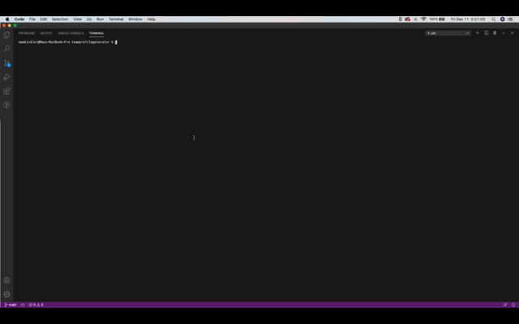

# TeamProfileGenerator

## Description

This project utilizes `node.js` to create a command line application that allows a user to generate a team profile displaying members of a team. With `node.js`, the user is prompted with a series of questions which they must answer in order to populate the team profile `HTML` file, which gets formatted using Bootstrap.

## Task

The final team profile file that is created will display the following:
* A header with the words My Team
* Cards that display each team member's title -- Manager, Engineer, or Intern -- along with their details
    * Manager cards include an ID, email address, and office number
    * Engineer cards include an ID, email address, and GitHub username
    * Intern cards include an ID, email address, and school

## Usage

This application can be used by places of employment that would like an efficient way of generating a visual of their full employee team.

## Installation

This application will require users to run the following command in their CLI prior to use:
* `npm install`

Following installation, the user should run the following command in their CLI at the root folder of their application.  The user will then be prompted to answer the questions that the application displays:
* `node app.js`

## Process

This project was designed using starter code, including:
* A lib folder containing all JS files that are required.  Most code had to be written for these files.
* A templates folder containing all `HTML` files that are required.  Code had been written for these files.
* A test folder containing all needed test files to ensure accurate code.
* The start of the `app.js` file for the full functionality of the application.

## Demo of Deployed Application and Running Tests for 100% Pass
GIF demonstrating the application passing all tests.
 

 
 
GIF demonstrating the application's function.
 

## Contributing

Please open a New Issue via GitHub for pull requests on this project that includes a description of what you would like to change.

## Ackknowledgment

* Trilogy Education Services
* [npm](https://www.npmjs.com/)
* [Regex](https://www3.ntu.edu.sg/home/ehchua/programming/howto/Regexe.html)
* [Bootstrap](https://getbootstrap.com/)